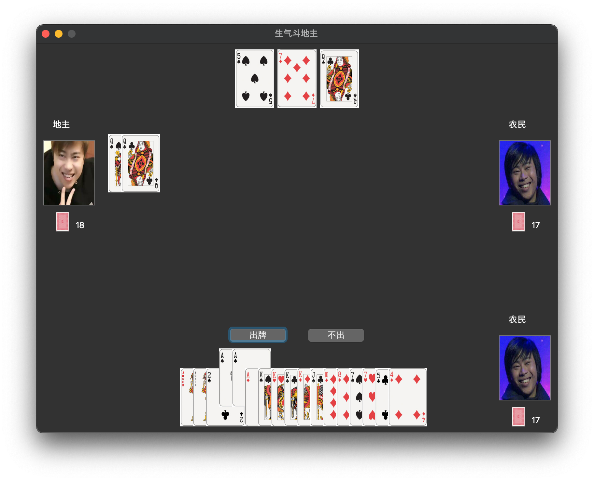

# Angry Doudizhu 生气斗地主

基于 Qt5，使用 C++ 编写的斗地主游戏。

支持使用 TCP 协议通信的联机对战。

图形界面在 macOS Catalina 和 Big Sur 上经过测试，其它平台上不保证长得一样。

> 注：本项目曾为清华大学计算机系 2020 年夏程序设计训练课程作业。

## 运行方式

Qt Creator 打开 `proj_snake.pro`；

执行 qmake；

构建项目；

运行。

## 效果

